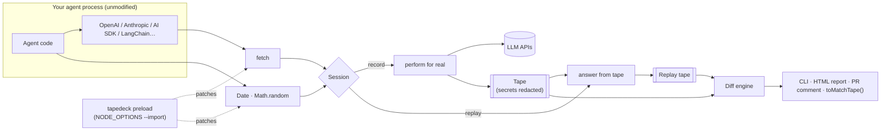

# TapeDeck

[](https://github.com/Niloy-Bhuiyan/tapedeck/actions/workflows/ci.yml)

**VCR for AI agents — record once, replay debugging for free.**

Record every LLM call, tool call, clock read and random draw your agent
makes into a portable **tape**. Replay it later with **zero API cost and no
network** — standalone, or against your *new* code — and see exactly which
step changed. **No code changes needed.**

```bash
npx tapedeck record -- node agent.js                 # run once for real
npx tapedeck replay tape.json --against "node agent.js"   # re-run free, offline, and diff
```

<!-- TODO: record and embed a demo GIF here -->

```text
Tapes diverge at step 8 of 12.
Step 8: LLM call (openai POST /v1/chat/completions) was sent a different request:
  - request.messages[3].content: "[{\"title\":\"Tokyo – population…" → "- Tokyo metropolis: …"
```

## Why

Agents are hard to test. Every run costs money, takes seconds, and never
does quite the same thing twice, so a "small prompt tweak" can quietly
change which tools get called and nobody notices until production.

TapeDeck turns one real run into a **free, deterministic, repeatable test**:

- 🎬 **Record anything that talks to an LLM over `fetch`.** The official
  OpenAI and Anthropic SDKs, Vercel AI SDK, LangChain.js, Gemini, Mistral,
  Groq, OpenRouter, Ollama… with no wrappers and no code changes.
- ⏪ **Replay offline, byte for byte.** Same responses (streams included),
  same `Date.now()`, same `Math.random()`. Rate-limit retries replay
  instantly.
- 🔍 **Pinpoint regressions.** Replay a tape against new code and get the
  first point of divergence in plain English: which step, which field, old
  value → new value.
- ✅ **Gate pull requests.** `tapedeck test` replays every tape in the repo;
  the GitHub Action comments on the PR when agent behaviour changes.
- 🔒 **Safe to commit.** API keys never touch the tape; well-known secrets
  are scrubbed automatically; add your own patterns with `--redact`.

## Try it in 10 seconds

```bash
git clone https://github.com/Niloy-Bhuiyan/tapedeck && cd tapedeck
npm install
npm run example:zero-code
```

This records an ordinary OpenAI streaming script
([`examples/zero-code/agent.mjs`](examples/zero-code/agent.mjs) — no TapeDeck
code in it), **switches the API server off**, replays the script identically,
then shows the diff when the prompt changes. No API key needed.

## Install

```bash
npm install --save-dev tapedeck
```

Until the first npm release: `npm install --save-dev github:Niloy-Bhuiyan/tapedeck`
(the `prepare` script builds it). Requires Node.js 22+.

## Quickstart

### 1. Record a real run

```bash
export OPENAI_API_KEY=sk-...
npx tapedeck record -o tapes/checkout.tape.json -- node agent.js
```

Any Node.js command works (`node`, `npx tsx`, `npm run …`). Calls to
well-known LLM APIs are recorded automatically; add others with
`--llm-host localhost:11434`, and record non-LLM HTTP APIs your tools call
(search, weather…) with `--http-host api.tavily.com`.

### 2. Replay it for free

```bash
npx tapedeck replay tapes/checkout.tape.json                        # view the timeline
npx tapedeck replay tapes/checkout.tape.json --against "node agent.js"   # re-run & diff
npx tapedeck report tapes/checkout.tape.json -o report.html         # visual timeline
```

Replays need no API key and make no network calls to recorded hosts.

### 3. Make it a regression test

```bash
npx tapedeck test tapes/          # replays every tape; exits 1 if any changed
npx tapedeck test tapes/ --update # intended change? re-record the ones that changed
```

In GitHub Actions (details in [docs/github-action.md](docs/github-action.md)):

```yaml
- run: npm ci
- uses: Niloy-Bhuiyan/tapedeck@main
  with:
    paths: tapes
```

Failing tapes get an inline annotation, a job summary, a PR comment and an
HTML diff report artifact.

### Or from your test runner

```ts
import { expect, test } from 'vitest';
import { replayTape } from 'tapedeck/vitest'; // registers toMatchTape()

test('checkout flow still behaves as recorded', async () => {
  expect(await replayTape('./tapes/checkout.tape.json')).toMatchTape();
});
```

For Jest add `tapedeck/jest` to `setupFilesAfterEnv` (ESM mode). Relax a
match with `toMatchTape({ ignorePaths: ['request.metadata.trace_id'] })`.

## In-process API

For unit tests or finer control, record and replay a function directly:

```ts
import OpenAI from 'openai';
import { record, replay, tool, writeTapeFile } from 'tapedeck';

const openai = new OpenAI();                        // intercepted via fetch
const search = tool('web_search', mySearchFn);      // optional: record a tool call explicitly

const { tape } = await record(() => agent.run('Buy socks'), { name: 'checkout' });
writeTapeFile('tapes/checkout.tape.json', tape);

const result = await replay('tapes/checkout.tape.json', () => agent.run('Buy socks'));
result.ok;           // true if behaviour is unchanged
result.diff.summary; // "Tapes diverge at step 4 of 9. …"
```

Import `tapedeck` before creating SDK clients (SDKs capture `fetch` when
constructed). Prefer explicit wrappers? `wrapOpenAI(client)` and
`wrapAnthropic(client)` record at the SDK level instead, with the same
replay guarantees.

## How it works



- **Capture.** The CLI preloads TapeDeck into every Node process the command
  starts. It patches `fetch` (calls to LLM hosts become `llm_call` events,
  with the JSON request/response or the raw SSE stream) and `Date` /
  `Math.random` (only reads made by *your* code — library internals such as
  SDK retry jitter are left alone, so tapes survive dependency upgrades).
- **Replay.** Each kind of event is answered in recorded order. Responses are
  rebuilt as real `Response` objects, so the SDK's own parsing and streaming
  code runs unchanged. Strict mode stops at the first mismatch; diff mode
  records every divergence and keeps going.
- **Diff.** Tapes are aligned step by step (LCS), compared field by field, and
  the first divergence is explained in plain English.

Design details and trade-offs: [DESIGN_NOTES.md](DESIGN_NOTES.md). Tape
specification: [docs/tape-format.md](docs/tape-format.md).

## CLI reference

| Command | What it does | Exit code |
| ------- | ------------ | --------- |
| `tapedeck record [-o tape] [-n name] -- <command…>` | Run a Node.js command for real and record it. | The command's |
| `tapedeck replay <tape>` | Print the tape as a timeline. Runs nothing. | 0 |
| `tapedeck replay <tape> --against "<command>"` | Run the command against the tape and diff. | 0 match, 1 differ |
| `tapedeck test [paths…] [--update]` | Replay every tape against its recorded command. | 0 all match, 1 otherwise |
| `tapedeck diff <a> <b>` | Compare two tapes. | 0 match, 1 differ |
| `tapedeck report <tape> [--diff <b>] [-o file.html]` | Self-contained HTML timeline or diff. | 0 |

Common options:

| Option | Meaning |
| ------ | ------- |
| `--llm-host <host>` | Treat another host as an LLM API (e.g. `localhost:11434`). Saved on the tape. |
| `--http-host <host>` | Record calls to a non-LLM API as tool events. Saved on the tape. |
| `--redact <regex>` | Scrub more patterns from tapes (API keys and tokens are always scrubbed). |
| `--ignore-path <path>` | Ignore a noisy field, e.g. `request.metadata.trace_id`, `request.messages[*].name`, `**.request_id`. |
| `--ignore <types>` | Leave event types out of diffs, e.g. `clock_read,random_draw`. |
| `--strict` | Stop at the first divergence instead of reporting all of them. |
| `--passthrough` | Perform calls the tape can't answer for real (costs money). |
| `--json` | Machine-readable output. |

## What a tape looks like

```jsonc
{
  "format": "tapedeck.tape",
  "version": 1,
  "id": "903da1a8-83fb-4941-bc8c-57f06fb21c0e",
  "name": "checkout",
  "createdAt": "2026-09-24T10:00:00.000Z",
  "metadata": { "command": "node agent.js", "tapedeckVersion": "0.2.0" },
  "events": [
    { "id": "clock_read:b93964f9:0", "seq": 0, "t": 3, "type": "clock_read", "source": "new Date", "value": 1790244000003 },
    { "id": "llm_call:e5b9eae2:0", "seq": 1, "t": 4, "type": "llm_call", "provider": "openai",
      "operation": "POST /v1/chat/completions",
      "request": { "model": "gpt-4.1-mini", "stream": true, "messages": [ … ] },
      "response": [ { "data": { "choices": [ { "delta": { "content": "Hi" } } ] } }, { "data": "[DONE]" } ],
      "stream": true, "http": { "status": 200, "headers": { "content-type": "text/event-stream" } }, "durationMs": 812 }
  ],
  "outcome": { "status": "ok", "exitCode": 0 }
}
```

Event types: `llm_call`, `tool_call`, `tool_result`, `clock_read`,
`random_draw`. Tapes are plain JSON (or JSONL), readable in code review.

## API at a glance

| Export | Purpose |
| ------ | ------- |
| `record(fn, opts?)` / `replay(tape, fn, opts?)` | In-process record and replay. |
| `recordCommand`, `replayCommand`, `runTapeTests` | Programmatic CLI. |
| `diffTapes(a, b, { ignoreTypes, ignorePaths }?)` | Structured diff with `steps`, `firstDivergence`, `summary`. |
| `tool(name, fn)`, `wrapOpenAI`, `wrapAnthropic`, `wrapClient` | Explicit, SDK-level interception. |
| `configureFetchInterception({ llmHosts, httpHosts })` | Add hosts for fetch-level capture. |
| `readTapeFile`, `writeTapeFile`, `parseTape`, `validateTape` | Tape I/O. |
| `formatTimeline`, `formatDiff`, `renderTapeReport`, `renderDiffReport` | Rendering. |
| `replayTape`, `tapeMatchers` (`tapedeck/vitest`, `tapedeck/jest`, `tapedeck/testing`) | Test-runner integration. |
| `MockOpenAI`, `MockAnthropic` | Deterministic offline providers for your own tests. |

## Examples

- [`examples/zero-code`](examples/zero-code) — an unmodified OpenAI
  streaming script, recorded and replayed from the outside.
- [`examples/research-agent`](examples/research-agent/README.md) — a
  tool-calling agent with a committed tape, a deliberate regression
  (`npm run example:regression`), and this repo's own end-to-end fixture.

Everything runs offline: the examples use a mock model or a fake local
OpenAI server when no key is set ([MOCKED_COMPONENTS.md](MOCKED_COMPONENTS.md)).

## Limitations

- Node.js only for now (Python is the most-requested next step — see
  [ISSUES_TODO.md](ISSUES_TODO.md)).
- Captures `fetch`. Clients built on `node:http` directly (e.g. axios) need
  the explicit wrappers or `tool()`.
- Streams are buffered while *recording* (the caller receives them after the
  response completes); replay is exact.
- `performance.now()` and `crypto.randomUUID()` are not captured; use
  `--ignore-path` for fields that carry them.

## Contributing

Contributions are welcome — see [CONTRIBUTING.md](CONTRIBUTING.md) and the
good first issues in [ISSUES_TODO.md](ISSUES_TODO.md).

## License

[MIT](LICENSE)
