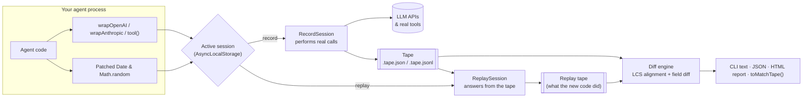

# TapeDeck

**VCR for AI agents — record once, replay debugging for free.**

TapeDeck records every LLM call, tool call, tool result, clock read and
random draw your agent makes into a portable **tape**. Replay the tape later
with **zero API cost** and **no network**, standalone or against *new* agent
code, and diff the two runs to see exactly where behaviour changed.

<!-- TODO: record and embed a demo GIF here -->

```text
$ npx tapedeck replay tapes/research-agent.tape.json --against "node agent.js"

  ✓  7  tool_result  web_search → [{"title":"Delhi – population and area",…
  ~  8  llm_call     openai chat.completions.create model=gpt-4.1-mini → tool calls: calculator
        │ request.messages[3].content: "[{\"title\":\"Tokyo – population…" → "- Tokyo metropolis: population 14,094,034…"
  ✓  9  tool_call    calculator({"expression":"(14094034 + 16787941) / (2194 + 1484)"})

Tapes diverge at step 8 of 12.
Step 8: LLM call (openai chat.completions.create) was sent a different request:
  - request.messages[3].content: "[{\"title\":\"Tokyo – population…" → "- Tokyo metropolis: …"
```

## Why

Agents are hard to test: every run costs money, takes seconds, and never
does quite the same thing twice. TapeDeck makes a run *deterministic and
free to repeat*:

- **Record** a real run once — LLM requests and responses, tool inputs and
  outputs, `Date.now()` / `new Date()`, `Math.random()`.
- **Replay** it any number of times offline. The code gets the exact same
  responses, the exact same clock, the exact same random numbers.
- **Diff** a replay of *new* code against the tape to catch regressions:
  different tool calls, different arguments, different prompts, different
  outcomes — with the first point of divergence explained in plain English.
- **Test** it in CI: `expect(await replayTape('./tapes/checkout.tape.json')).toMatchTape()`.

Works with the official [`openai`](https://www.npmjs.com/package/openai) and
[`@anthropic-ai/sdk`](https://www.npmjs.com/package/@anthropic-ai/sdk)
clients, any tool function, and any test runner with Jest-style matchers.
Zero runtime dependencies.

## Install

```bash
npm install --save-dev tapedeck
```

Until the first npm release, install from GitHub (the `prepare` script
builds it):

```bash
npm install --save-dev github:Niloy-Bhuiyan/tapedeck
```

Requires Node.js 20.6+. TapeDeck is an ES module.

## Quickstart

### 1. Wrap your client and tools

```ts
import OpenAI from 'openai';
import { tool, wrapOpenAI } from 'tapedeck';

const openai = wrapOpenAI(new OpenAI()); // same API as before
const search = tool('web_search', async ({ query }: { query: string }) => mySearchApi(query));
```

`wrapAnthropic(new Anthropic())` does the same for Claude. Outside a
recording or replay the wrappers are pass-throughs.

### 2a. Record and replay from the CLI

```bash
# Run your agent for real and record everything it did
npx tapedeck record -o tapes/checkout.tape.json -- node agent.js

# Look at the tape (runs nothing, costs nothing)
npx tapedeck replay tapes/checkout.tape.json

# Replay the tape against your current code and diff the runs
npx tapedeck replay tapes/checkout.tape.json --against "node agent.js"

# Compare any two tapes, or render one as an HTML timeline
npx tapedeck diff tapes/before.tape.json tapes/after.tape.json
npx tapedeck report tapes/checkout.tape.json --diff tapes/after.tape.json -o report.html
```

### 2b. …or in code

```ts
import { record, replay, writeTapeFile } from 'tapedeck';

const { tape } = await record(() => agent.run('Buy socks'), { name: 'checkout' });
writeTapeFile('tapes/checkout.tape.json', tape);

const result = await replay('tapes/checkout.tape.json', () => agent.run('Buy socks'));
result.ok;                          // true if behaviour is unchanged
result.diff.summary;                // "Tapes diverge at step 4 of 9. …"
```

### 3. Regression-test it in CI (Vitest)

```ts
import { expect, test } from 'vitest';
import { replayTape } from 'tapedeck/vitest'; // registers toMatchTape()

test('checkout flow still behaves as recorded', async () => {
  // Re-runs the command the tape was recorded with, fully offline.
  expect(await replayTape('./tapes/checkout.tape.json')).toMatchTape();
});

test('in-process variant', async () => {
  expect(await replayTape('./tapes/checkout.tape.json', () => agent.run('Buy socks'))).toMatchTape();
});
```

For Jest, add `tapedeck/jest` to `setupFilesAfterEnv` (Jest must run in ESM
mode), or call `expect.extend(tapeMatchers)` yourself with
`import { tapeMatchers } from 'tapedeck/testing'`. A failing match prints the
full step-by-step diff. Relax it with e.g.
`toMatchTape({ ignoreTypes: ['clock_read'] })`.

### Try the example

The repo includes a small tool-calling research agent with a pre-recorded
tape. It runs offline out of the box:

```bash
git clone https://github.com/Niloy-Bhuiyan/tapedeck && cd tapedeck
npm install
npm run example             # run the agent (mock model, no API key needed)
npm run example:replay      # replay its tape against the code → match
npm run example:regression  # replay against a "refactored" v2 → diverges at step 8
```

See [examples/research-agent](examples/research-agent/README.md).

## Architecture



- **Interceptors** (`src/interceptors`) route SDK calls and tool calls to
  the active session. A `Proxy` keeps the rest of the SDK untouched.
- **Runtime** (`src/runtime`) holds the sessions. `AsyncLocalStorage` scopes a
  session to one `record()` / `replay()` callback — or, under the CLI, to the
  whole process — so concurrent tests never mix. Real SDK and tool calls run
  with capture suspended, since they are replayed as a whole.
- **Tape** (`src/tape`) defines the format, stable content-derived event IDs,
  validation, and JSON/JSONL I/O. Spec: [docs/tape-format.md](docs/tape-format.md).
- **Replay** matches each kind of event in recorded order. Strict mode throws
  at the first mismatched call; diff mode records every divergence and keeps
  going. Recorded errors are re-thrown faithfully.
- **Diff** (`src/diff`) aligns two tapes step by step and explains the first
  divergence. **Format** and **report** render it for terminals and browsers.
- **CLI** (`src/cli`) spawns your command with a few environment variables;
  importing `tapedeck` in that process picks them up and records or replays.

More detail and the reasoning behind these choices:
[DESIGN_NOTES.md](DESIGN_NOTES.md).

## What a tape looks like

```jsonc
{
  "format": "tapedeck.tape",
  "version": 1,
  "id": "903da1a8-83fb-4941-bc8c-57f06fb21c0e",
  "name": "research-agent",
  "createdAt": "2026-09-23T20:41:25.143Z",
  "metadata": { "command": "node --import tsx examples/research-agent/main.ts", "tapedeckVersion": "0.1.0" },
  "events": [
    { "id": "clock_read:b93964f9:0", "seq": 0, "t": 37, "type": "clock_read", "source": "Date.now", "value": 1790196085179 },
    { "id": "llm_call:e5b9eae2:0", "seq": 2, "t": 37, "type": "llm_call", "provider": "openai",
      "operation": "chat.completions.create", "request": { "model": "gpt-4.1-mini", "messages": [ … ] },
      "response": { "choices": [ … ] }, "durationMs": 1 },
    { "id": "tool_call:c826a7b5:0", "seq": 3, "t": 38, "type": "tool_call", "tool": "web_search",
      "callId": "tool_call:c826a7b5:0", "args": { "query": "tokyo population and area" } }
  ],
  "outcome": { "status": "ok", "exitCode": 0 }
}
```

Event types: `llm_call`, `tool_call`, `tool_result`, `clock_read`,
`random_draw`. Full specification: [docs/tape-format.md](docs/tape-format.md).

## CLI reference

| Command | What it does | Exit code |
| ------- | ------------ | --------- |
| `tapedeck record [-o tape] [-n name] -- <command…>` | Run the command for real and record it. | The command's |
| `tapedeck replay <tape> [--json]` | Print the tape as a timeline. Runs nothing. | 0 |
| `tapedeck replay <tape> --against "<command>" [--strict] [--passthrough] [-o tape] [--ignore types] [--json]` | Run the command against the tape and diff. | 0 match, 1 differ |
| `tapedeck diff <a> <b> [--ignore types] [--json]` | Compare two tapes. | 0 match, 1 differ |
| `tapedeck report <tape> [--diff <b>] [-o file.html]` | Write a self-contained HTML timeline or diff. | 0 |

`--ignore` takes comma-separated event types, e.g.
`--ignore clock_read,random_draw`. `--passthrough` performs calls the tape
cannot answer for real (this costs money). The recorded program must import
`tapedeck` (it does if it uses the wrappers) — that is how it connects to the
CLI.

## API at a glance

| Export | Purpose |
| ------ | ------- |
| `wrapOpenAI(client)`, `wrapAnthropic(client)`, `wrapClient(client, provider, ops)` | Intercept SDK calls. |
| `tool(name, fn)` | Intercept a tool. |
| `record(fn, opts?)` | Run `fn` for real and return `{ ok, result \| error, tape }`. |
| `replay(tape, fn, { mode, passthrough, diff }?)` | Run `fn` against a tape; returns `{ ok, result, divergences, diff, actual, expected }`. |
| `diffTapes(a, b, { ignoreTypes, ignoreOutcome }?)` | Structured diff with `steps`, `firstDivergence`, `summary`. |
| `recordCommand`, `replayCommand` | Programmatic versions of the CLI. |
| `readTapeFile`, `writeTapeFile`, `parseTape`, `validateTape` | Tape I/O. |
| `formatTimeline`, `formatDiff`, `renderTapeReport`, `renderDiffReport` | Rendering. |
| `replayTape`, `tapeMatchers` (`tapedeck/testing`, `tapedeck/vitest`, `tapedeck/jest`) | Test integration. |
| `MockOpenAI`, `MockAnthropic` | Deterministic offline providers for tests. |

## API keys and mocks

Nothing needs a key to run: tests, the CLI and the example use deterministic
mock providers when `OPENAI_API_KEY` / `ANTHROPIC_API_KEY` are unset (see
[.env.example](.env.example)). Replays never call the API even when keys are
set. What is mocked and how to switch to real providers:
[MOCKED_COMPONENTS.md](MOCKED_COMPONENTS.md).

## Limitations

- Streams are recorded by buffering and replayed as plain async iterables.
- Intercepted SDK methods return plain Promises (no `.withResponse()`).
- `performance.now()` and `crypto` randomness are not captured yet.

## Contributing

Contributions are welcome — see [CONTRIBUTING.md](CONTRIBUTING.md), and
[ISSUES_TODO.md](ISSUES_TODO.md) for good first issues.

## License

[MIT](LICENSE)
